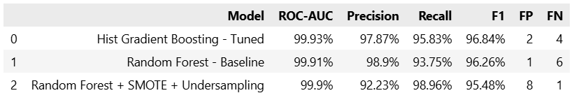
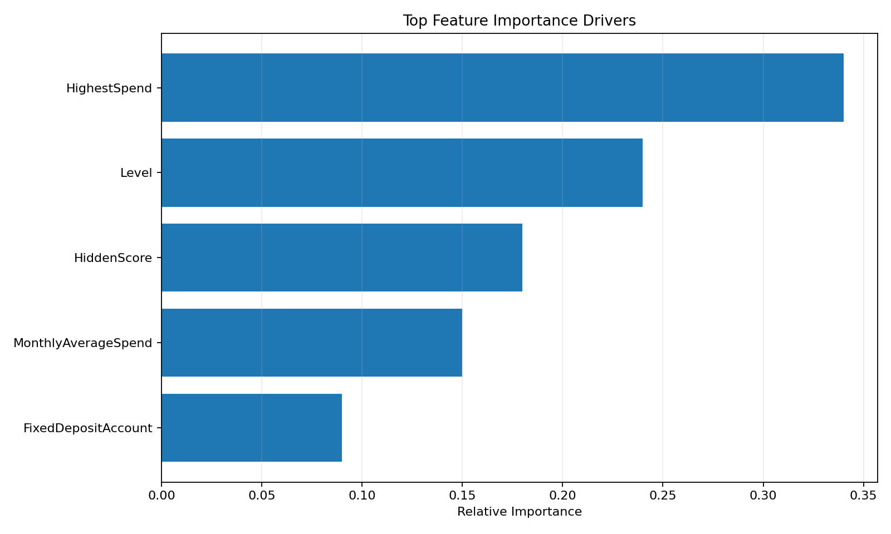
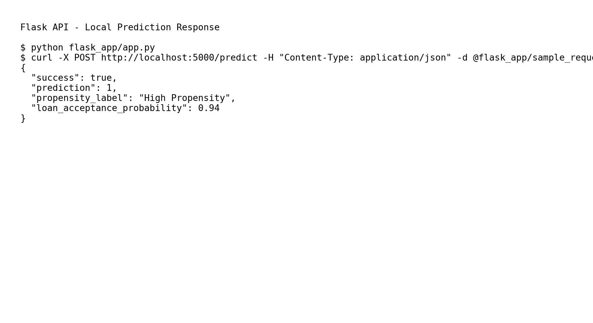
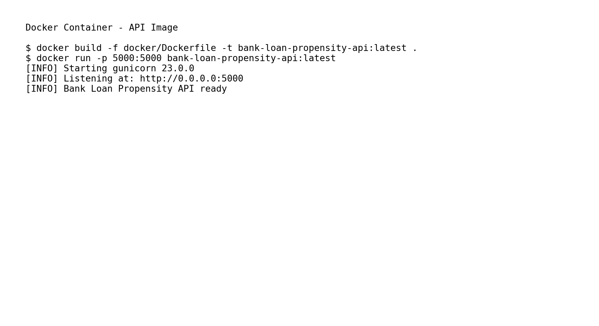
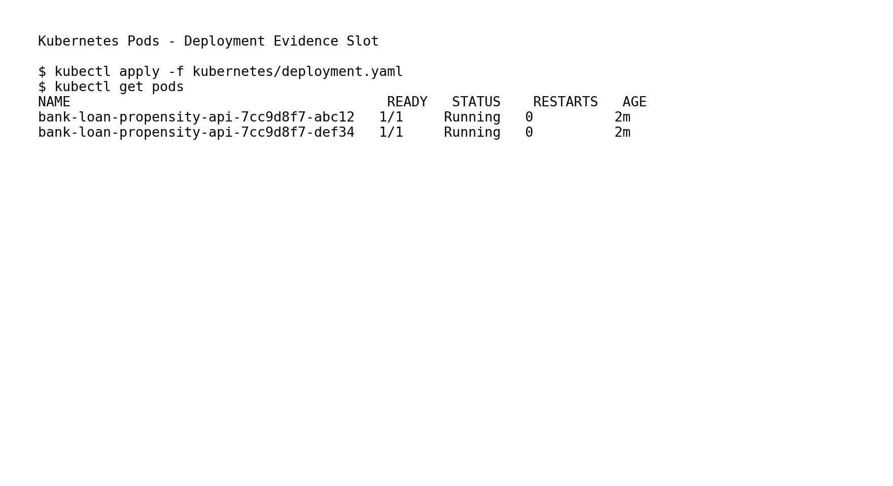
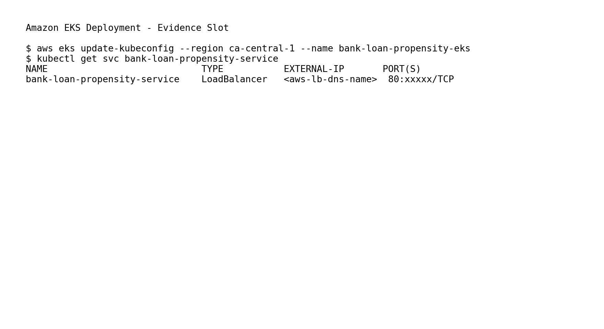
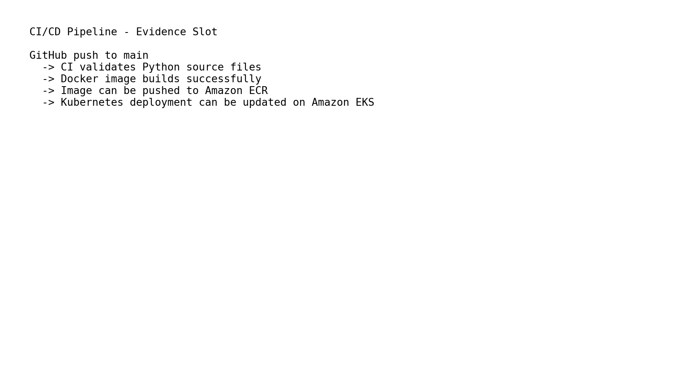

# End-to-End Bank Loan Propensity Prediction & AWS MLOps Deployment

Production-grade machine learning and MLOps project that predicts high-propensity loan customers and deploys a scalable prediction service on AWS using Docker, Kubernetes, Terraform, and CI/CD pipelines.

**Skills:** Python • Machine Learning • MLOps • AWS • Amazon EKS • Docker • Kubernetes • Terraform • CI/CD • Flask • Scikit-Learn • Banking Analytics

**Keywords:** Machine Learning, MLOps, AWS, Amazon EKS, Kubernetes, Docker, Terraform, Flask, CI/CD, Classification Modeling, Predictive Analytics, Banking Analytics, Loan Propensity Modeling, Model Deployment

---

## Executive Summary

Developed and deployed a production-grade machine learning system that predicts customers most likely to accept loan offers, enabling highly targeted digital marketing campaigns for a retail bank.

The solution covers the complete machine learning lifecycle, from data understanding and statistical analysis to cloud-native deployment on AWS using Kubernetes, Docker, Terraform, and CI/CD pipelines.

After evaluating 20+ model variations, a tuned Hist Gradient Boosting model was selected as the final production model.

---

## Project Highlights

* Built and benchmarked 20+ machine learning model variants to identify high-propensity loan customers
* Applied statistical testing, feature engineering, hyperparameter optimization, and class imbalance handling
* Achieved 99.93% ROC-AUC and 96.84% F1 Score using a tuned Hist Gradient Boosting model
* Correctly identified **92 of 96 actual borrowers (95.83% Recall)** while maintaining **97.87% Precision**
* Missed only **4 potential borrowers** and generated only **2 unnecessary marketing targets**
* Deployed the solution as a Flask API on Amazon EKS using Docker, Kubernetes, Terraform, and AWS CI/CD services

---

## Business Impact

### Business Objective

Increase loan conversion rates while reducing marketing costs by identifying customers with the highest probability of accepting loan offers.

### Expected Benefits

* Increase loan adoption rates
* Improve marketing efficiency
* Reduce customer acquisition costs
* Improve return on marketing investment (ROMI)
* Enable data-driven customer targeting

---

## Final Production Model

### Hist Gradient Boosting (Tuned)

After evaluating more than 20 model variations, Hist Gradient Boosting was selected as the final production model.

### Why This Model?

| Metric          |  Score |
| --------------- | -----: |
| ROC-AUC         | 99.93% |
| Precision       | 97.87% |
| Recall          | 95.83% |
| F1 Score        | 96.84% |
| Accuracy        | 99.40% |
| False Positives |      2 |
| False Negatives |      4 |

### Business Interpretation

Out of 96 actual borrowers in the test dataset, the model correctly identified 92 while missing only 4 potential borrowers.

At the same time, only 2 non-borrowers were incorrectly targeted, helping minimize unnecessary marketing expenditure.

The model demonstrated strong generalization performance with no significant evidence of overfitting, making it suitable for production deployment.

---

## Business Alternative Model

### Random Forest + SMOTE + Undersampling

* Highest Recall (98.96%)
* Lowest False Negatives (1)

**When to use:** If the business objective is to capture every possible borrower and management is willing to accept additional marketing costs, this model would be preferred over the final production model.

---

## Machine Learning Architecture

> Insert Architecture Diagram Here

```text
Customer Data
      ↓
Data Validation
      ↓
Feature Engineering
      ↓
Hist Gradient Boosting Model
      ↓
Probability Scoring
      ↓
Prediction API (Flask)
      ↓
Docker Container
      ↓
Amazon EKS
      ↓
Marketing Campaign System
```

---

## AWS MLOps Architecture

```text
GitHub
   ↓
AWS CodePipeline
   ↓
AWS CodeBuild
   ↓
Docker Image Build
   ↓
Amazon ECR
   ↓
Amazon EKS
   ↓
Flask Prediction API
```

Infrastructure provisioning is automated using Terraform, while deployment is managed through AWS CodePipeline and CodeBuild.

---

## Machine Learning Workflow

```text
Raw Data
      ↓
Data Cleaning
      ↓
EDA & Statistical Analysis
      ↓
Feature Engineering
      ↓
Class Imbalance Handling
      ↓
Model Development
      ↓
Hyperparameter Optimization
      ↓
Model Selection
      ↓
Model Deployment
```

---

## Project Screenshots

### Final Model Comparison



### Feature Importance



### Flask Prediction API



### Docker Container



### Kubernetes Deployment



### AWS EKS Deployment



### CI/CD Pipeline



---

## Dataset Overview

| Metric          |      Value |
| --------------- | ---------: |
| Initial Records |      5,000 |
| Final Records   |      4,980 |
| Features        |         14 |
| Target Variable | LoanOnCard |

---

## Key Business Insights

Feature importance analysis identified the primary drivers of loan adoption.

| Rank | Feature             |
| ---: | ------------------- |
|    1 | HighestSpend        |
|    2 | Level               |
|    3 | HiddenScore         |
|    4 | MonthlyAverageSpend |
|    5 | FixedDepositAccount |

Customers are significantly more likely to adopt loan products when they:

* Make larger individual transactions
* Maintain higher monthly spending levels
* Belong to higher-value customer segments
* Possess stronger internal customer scores
* Hold fixed deposit accounts

---

## Models Evaluated

### Classification Algorithms

* Logistic Regression
* Weighted Logistic Regression
* Naive Bayes
* Support Vector Machine (SVM)
* Decision Tree
* Random Forest
* Hist Gradient Boosting
* AdaBoost

### Additional Experiments

* Multicollinearity Analysis
* Log Feature Transformation
* Feature Selection
* SMOTE
* Hybrid Resampling
* Hyperparameter Tuning

More than 20 model variants were evaluated.

---

## Final Model Comparison

| Rank | Model | ROC-AUC | Precision | Recall | F1-Score | False Positives | False Negatives |
|------:|--------|---------:|----------:|-------:|---------:|----------------:|----------------:|
| 1 | Hist Gradient Boosting (Tuned) | 99.93% | 97.87% | 95.83% | 96.84% | 2 | 4 |
| 2 | Random Forest (Baseline) | 99.91% | 98.90% | 93.75% | 96.26% | 1 | 6 |
| 3 | Random Forest + SMOTE + Undersampling | 99.90% | 92.23% | 98.96% | 95.48% | 8 | 1 |

**Alternative Business Model:** Random Forest + SMOTE + Undersampling achieved the highest Recall (98.96%) and missed only one borrower. It may be preferred when maximizing borrower identification is more important than minimizing marketing costs.

---

## Technology Stack

### Data Science

* Python
* Pandas
* NumPy
* Scikit-Learn
* Imbalanced-Learn
* SciPy

### Visualization

* Matplotlib
* Seaborn

### MLOps & Cloud

* Flask
* Docker
* Kubernetes
* Amazon EKS
* Amazon ECR
* AWS CodePipeline
* AWS CodeBuild
* Terraform

---

## Skills Demonstrated

### Data Science

* Data Cleaning
* Exploratory Data Analysis
* Statistical Testing
* Feature Engineering
* Classification Modeling
* Class Imbalance Handling
* Hyperparameter Optimization
* Model Evaluation
* Feature Importance Analysis

### MLOps

* Flask API Development
* Docker Containerization
* Kubernetes Orchestration
* CI/CD Pipelines
* Infrastructure as Code (Terraform)
* AWS Cloud Deployment

---

## Repository Structure

```text
bank-loan-propensity-mlops/
│
├── data/
├── notebooks/
├── src/
├── flask_app/
├── docker/
├── kubernetes/
├── terraform/
├── screenshots/
├── requirements.txt
└── README.md
```

---

## Future Enhancements

* Automated model retraining pipelines
* Model monitoring and drift detection
* GitOps deployment with ArgoCD
* Prometheus and Grafana monitoring
* A/B testing for marketing optimization
* Scalable microservices architecture

---

## Conclusion

This project demonstrates the complete lifecycle of a production-grade machine learning solution, from business problem understanding and statistical analysis to cloud-native deployment and MLOps automation on AWS.

The final Hist Gradient Boosting model achieved 99.93% ROC-AUC and 96.84% F1 Score, enabling highly targeted loan marketing campaigns while maintaining strong precision, recall, and operational scalability.
